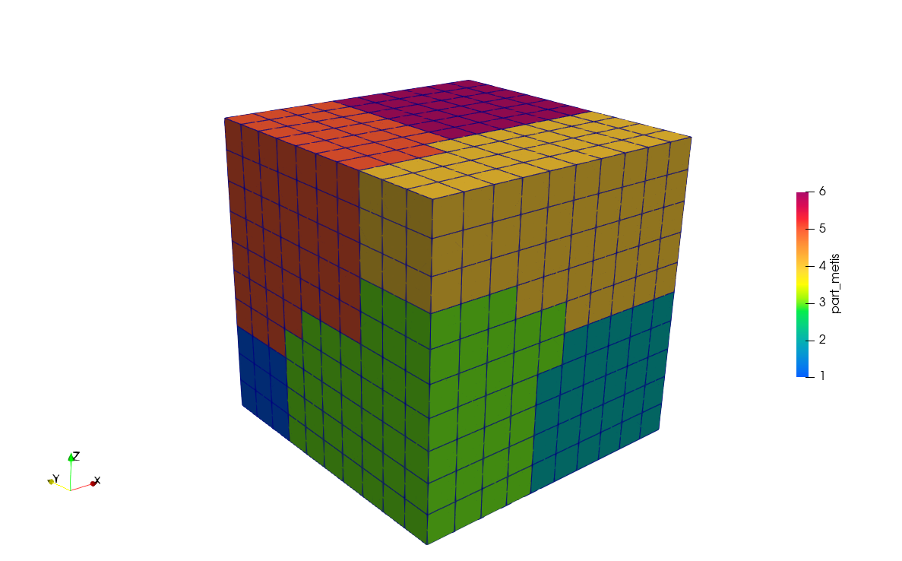

# prepar


[](https://github.com/lmn-labest/prepar/actions/workflows/build.yml)

Index
- [prepar](#prepar)
  - [Compilar o metis no linux](#compilar-o-metis-no-linux)
  - [Compilar o prepar](#compilar-o-prepar)
  - [Rodando o prepar](#rodando-o-prepar)
  - [Exemplo](#exemplo)
  - [Pre-compilados](#pre-compilados)
  - [Docker](#docker)

## Compilar o metis no linux

Para compilar o metis basta seguir os seguintes passos:

```console
cd metisLib
tar -xvzf metis-5.1.0.tar.gz
cd metis-5.1.0
make config
make
mkdir -p ./../../lib/
cp -v build/Linux-x86_64/libmetis/libmetis.a ../../lib/
cd ../../
```

Estes comandos irão descompactar e compilar o `metis5`, configurar o `make`, excetar a compilação e copiar automaticamente a `libmetis.a` para a pasta `lib`. A `libmetis.a` será utilizada depois para a compilação do `prepar`

> ⚠️⚠️ OBS: Você precisa ter instalado o `cmake` por causa do metis.

> ⚠️⚠️ OBS: As versões novas do metis que estão  disponiveis no `github` precisam dessa lib extra `libGKlib`. As versões mais antigas do `metis` podem ser encontrados [aqui](http://glaros.dtc.umn.edu/gkhome/metis/metis/download). As `prepar` só funciona com as versão antigas do `metis`.


## Compilar o prepar

O primeiro passo é fazer uma copia do `Makefile_base`

```console
cp contrib/Makefile_base Makefile
```

Antes de compilar o `prepar` a estrutura do projeto tem que ser algo similar à:

```console
├── include
│   ├── elementos.fi
│   ├── gauss.fi
│   ├── load.fi
│   ├── parallel.fi
│   ├── readfile.fi
│   ├── string.fi
│   ├── termprop.fi
│   ├── time.fi
│   └── transiente.fi
├── lib
│   └── libmetis.a
├── Makefile
└── src
    ├── Adjacency.f
    ├── Filenames.f
    ├── Main.f
    ├── Malloc.f
    ├── Mpi_comunicate.f
    ├── Parallel_imp.f
    ├── Partdmesh.f
    ├── Pdmetis.f
    ├── Propnode.f
    ├── Rdata.f
    ├── Read_mef.f
    ├── Read_metis.f
    ├── Time.f
    ├── Vtk.f
    ├── Write_mef.f
    ├── Write_par.f
    └── Write_vtk.f
```

Agora para compilar fazer basta:

```console
make
```

O executável do `prepar` estará na pasta `bin`. Como foi usando a opção `-static` pode ser que seja necessario instalar lib extras no sistema como a `glibc-static`. Outra opção é tirar a opção `-static` do `Makefile`.

## Rodando o prepar

Criar um arquivo `pre.dat` com o conteudo

```
input  mesh.dat
output     part
div          12
method non-overllaping
partVtk     yes
partMeshVtk yes
partMeshMef yes
meshLoads    no
vtkBin      yes
memory     1000
end
```

## Exemplo

Exsite um exemplo de aquivo de entrada na pastas  `contrib/bin/`. Para usa-lo primeiro vamos descompacta-lo para a pasta `bin/`.

```console
mkdir -p bin
tar -xvzf contrib/examples/solo.tar.gz -C bin/
```

Agora para gerar o particionamento basta executar o `prepar` na pasta `bin/`.

```console
./prepar solo/pre.dat
```

Após rodar o `prepar` a pasta dever ser 

```console
solo/
├── config
│   ├── grav.dat
│   ├── poromec.config
│   ├── poromec.solver
│   └── setprint.dat
├── mesh
│   ├── solo1_boun.dat
│   ├── solo1_coor.dat
│   ├── solo1_elmt.dat
│   ├── solo1_elmtloads.dat
│   └── solo1_initial.dat
├── output
├── part
│   ├── solo1_par_0.dat
│   ├── solo1_par_1.dat
│   ├── solo1_par_2.dat
│   ├── solo1_par_3.dat
│   ├── solo1_par_4.dat
│   ├── solo1_par_5.dat
│   ├── solo1_par_n_0_my_part.vtk
│   ├── solo1_par_n_1_my_part.vtk
│   ├── solo1_par_n_2_my_part.vtk
│   ├── solo1_par_n_3_my_part.vtk
│   ├── solo1_par_n_4_my_part.vtk
│   ├── solo1_par_n_5_my_part.vtk
│   ├── solo1_par_n_6_part.vtk
│   └── solo1_par_pre_t_6.txt
├── pre.dat
├── run
│   ├── nloads.dat
│   ├── node.dat
│   └── run.dat
└── solo1.dat
```

As pastas `run`, `mesh`, `config` e o arquivo `solo1.dat` são os arquivos de entrada da simulação do `mefpar` em sequencial. Na pasta `solo/part` ficam salvos os arquivos do particionamento `*.dat` e `*.vtk`. Os arquivos `solo1_par_*.dat` são arquivos de entrada para a simulação em paralelo do `mefpar`.

Exemplo da malha particonada em 6 partições



> ⚠️⚠️ OBS: 
> ⚠️⚠️ OBS: A estrura de pastas dos arquivos de `input` e o`output` podem ser mudadas. Essa estrutura é apenas a que eu gosto, mas você pode ficar a vontade de experimentar outras.


## Pre-compilados

Versões pré compilados para `linux` pode ser encotradas aqui [binarios](https://github.com/lmn-labest/prepar/releases/tag/0.1.0)

## Docker

Caso você queria rodar utilizando containers temos um `Dockerfile` configurado.

Para gerar a imagem, este procedimento precisa ser feito apenas uma única vez:

```console
docker build -t prepar:latest .
```

Para executar o `prepar` e gerar o parcionamento:

```console
docker run --rm -it -v "$(pwd)/bin/solo/:/usr/build/solo/" prepar solo/pre.dat
```
